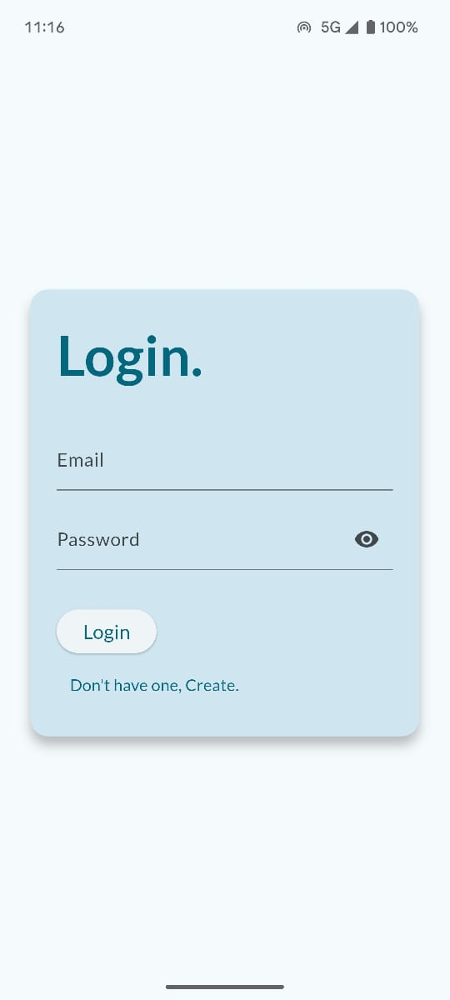
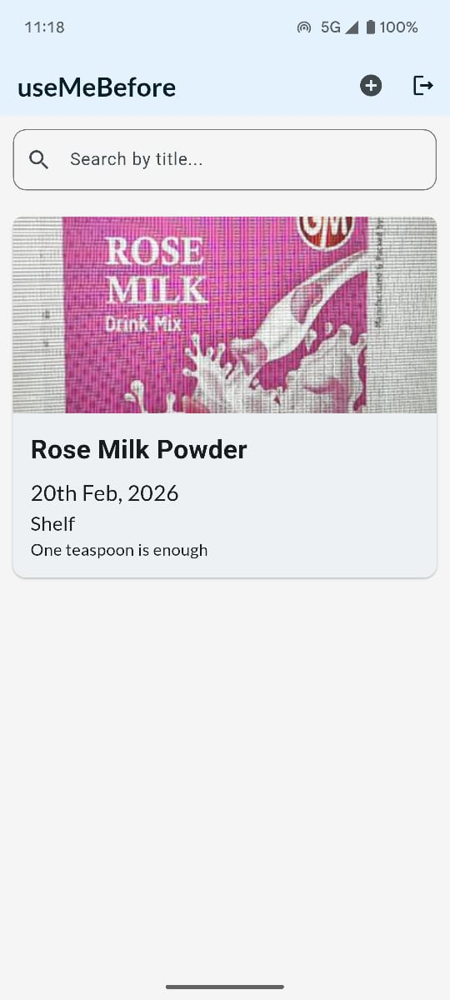
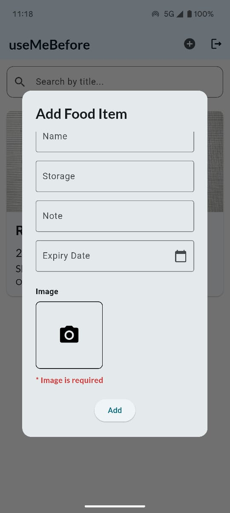

# 🕒 useMeBefore

A smart Flutter app to track items with expiry dates – food, medicine, cosmetics, and more. Never let things go to waste again!


## 🚀 Features

- 🔐 **Login & Signup** with Firebase Auth  
- 📦 **Add Items** with:
  - Name
  - Expiry Date
  - Storage Type
  - Notes
  - Image Upload  
- 🔍 **Search** by title  
- 🗑️ **Swipe to Delete** expired or unwanted items  
- ☁️ **Data Synced** with Firebase Firestore


## Screenshots

### Login Page


### 🏠 Home Page


### ➕ Add Item



## 🛠️ Tech Stack

- **Frontend:** Flutter  
- **Backend:** Firebase Auth + Firestore  
- **Storage:** Firebase Storage  

## 📦 Installation

### 1. Clone the repo
```bash
git clone https://github.com/a-anuj/usemebefore.git
cd usemebefore
```

### 2. Install Dependencies
```bash
flutter pub get
```

### 3. Run the app
```
flutter run
```

### 📱Generate APK to use it locally on your android phone
```bash
flutter build apk
```